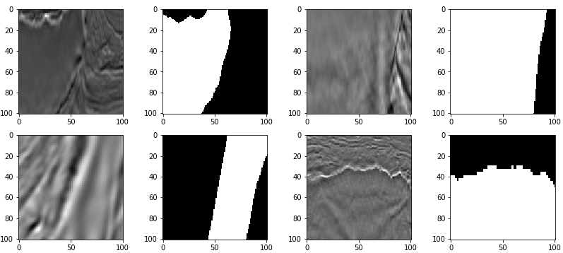

# TGS Salt Identification (Kaggle, Image Segmentation)
This is a Kaggle competition on Image Segmentation. We have to identify pixels in seismic images with salt sediment present. Here I will use UNet (Encoder and Decoder) to tackle the challenge.
[Fork the Solution notebook](https://colab.research.google.com/drive/1SizODTyCuC8wF4U0Llr3vjv3fw3_R198)

## Problem
In the problem, there were 4000 seismic images with their corresponding Masks. So to tackle the challenge we have to segment each pixel of seismic image as salt sediment is present or not. The mask are submitted as Run-Length Encoding. Below is the sample seismic images and their corresponding masks.

## Solution
I tried different Unet network architectures such as 

1. Encoder and Decoder of Unet from Scratch.
2. Pretrained VGG16 as Encoder and Decoder from scratch.
3. Pretrained ResNet34 as Encoder and Decoder from scratch.
4. Pretrained VGG19 as Encoder and Decoder from scratch.

My final submission was with "Pretrained VGG19 as Encoder and Decoder" which has given me **Private Score of 0.67620** and **Public Score of 0.64851**. Training and Validaiton metrics of Trained model are given below.

## Model Architecture
I have used combination of multiple losses which includes lovasz_hinge, binary crossentropy, dice loss with weightage 0.7, 0.15, and 0.15 respectively. Also I have used Conv2D transpose layers for upsampling. Detailed architecure is given below.

I have used the metric called IOU (Intersection over Union) metric to track progress and trained Unet with Adam optimizer for 40-60 epochs with decaying learning rate between 1e-3 to 1e-4. I have also performed Image augmentation with include horizontal flip, brightness change, zoom. Train and test split was stratified using depth.

## Concepts Learned
### 1. **Semantic Image Segmentation**
Semantic segmentation is one of the key problems in the field of computer vision. Looking at the big picture, semantic segmentation is one of the high-level task that paves the way towards complete scene understanding.  
Semantic segmentation achieves fine-grained inference by making dense predictions inferring labels for every pixel, so that each pixel is labeled with the class of its enclosing object ore region. 

### 2. **UNET**
The original Fully Convolutional Network (FCN) learns a mapping from pixels to pixels, without extracting the region proposals. The FCN network pipeline is an extension of the classical CNN. A particular architecture UNET, which use a Fully Convolutional Network Model for the task of Image Segmentation.

The architecture contains two paths. First path is the contraction path (also called as the encoder) which is used to capture the context in the image. The encoder is just a traditional stack of convolutional and max pooling layers. The second path is the symmetric expanding path (also called as the decoder) which is used to enable precise localization using transposed convolutions. Thus it is an end-to-end fully convolutional network (FCN), i.e. it only contains Convolutional layers and does not contain any Dense layer because of which it can accept image of any size.

Encoder network learns the “WHAT” information in the image, however it has lost the “WHERE” information. Intuitively, the Decoder recovers the “WHERE” information (precise localization) by gradually applying up-sampling. To get better precise locations, at every step of the decoder we use skip connections by concatenating the output of the transposed convolution layers with the feature maps from the Encoder at the same level. [Read in Detail](https://towardsdatascience.com/understanding-semantic-segmentation-with-unet-6be4f42d4b47)

### 3. **Dice Loss**
Another popular loss function for image segmentation tasks is based on the Dice coefficient, which is essentially a measure of overlap between two samples. This measure ranges from 0 to 1 where a Dice coefficient of 1 denotes perfect and complete overlap. The Dice coefficient was originally developed for binary data, and can be calculated as:

**Dice = 2|A∩B|/|A|+|B|**

where |A∩B| represents the common elements between sets A and B, and |A| represents the number of elements in set A (and likewise for set B). A smooth coefficinet is also added to numerator and denominator to prevent division by zero and prevent overfitting. [Read in Detail](https://forums.fast.ai/t/understanding-the-dice-coefficient/5838)

### 4. **Intersection over Union (IOU) metric (The Jaccard index)**
It is essentially a method to quantify the percent overlap between the target mask and our prediction output. This metric is closely related to the Dice coefficient which is often used as a loss function during training. 
Quite simply, the IoU metric measures the number of pixels common between the target and prediction masks divided by the total number of pixels present across both masks.

The intersection (A∩B) is comprised of the pixels found in both the prediction mask and the ground truth mask, whereas the union (A∪B) is simply comprised of all pixels found in either the prediction or target mask. [Read More in Detail](https://www.jeremyjordan.me/evaluating-image-segmentation-models/)

### 5. **Lovasz loss**
A tractable surrogate for the optimization of the intersection-over-union measure in neural networks. In order to optimize the Jaccard index (IOU) in a continuous optimization framework, we use the Lovász hinge, a tight convex surrogate to submodular losses. [Read in Detail](https://arxiv.org/abs/1705.08790)

## Author:
* Aditya Jain : [Portfolio](https://adityajn105.github.io)

## To Read:
1. [Image Segmentation, ConvNet, FCN, Unet](https://towardsdatascience.com/understanding-semantic-segmentation-with-unet-6be4f42d4b47)
2. [Up-sampling with Transposed Convolution](https://towardsdatascience.com/up-sampling-with-transposed-convolution-9ae4f2df52d0)
3. [Another Good Kaggle Solution](https://www.kaggle.com/meaninglesslives/pretrained-resnet34-in-keras)